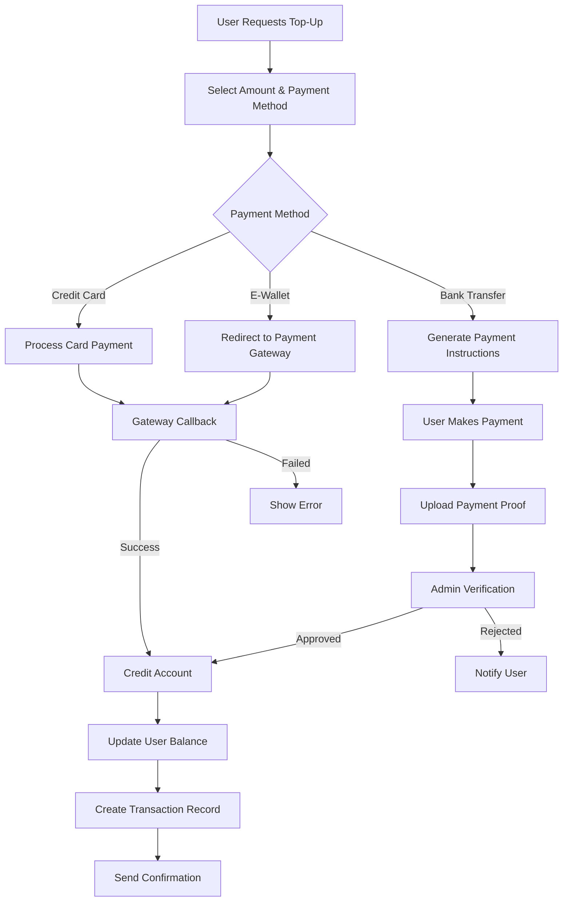
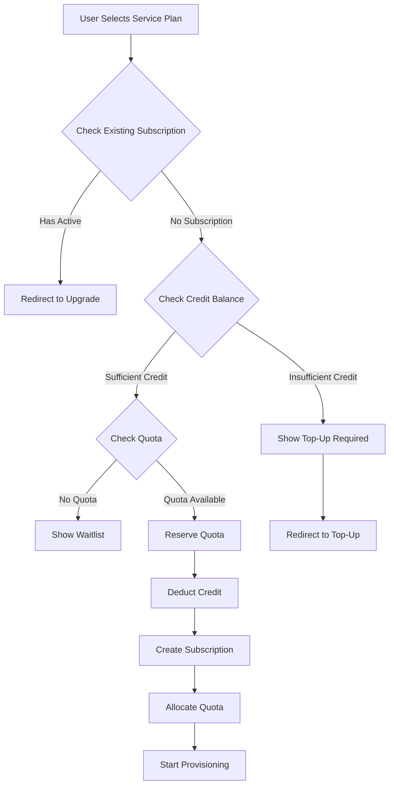
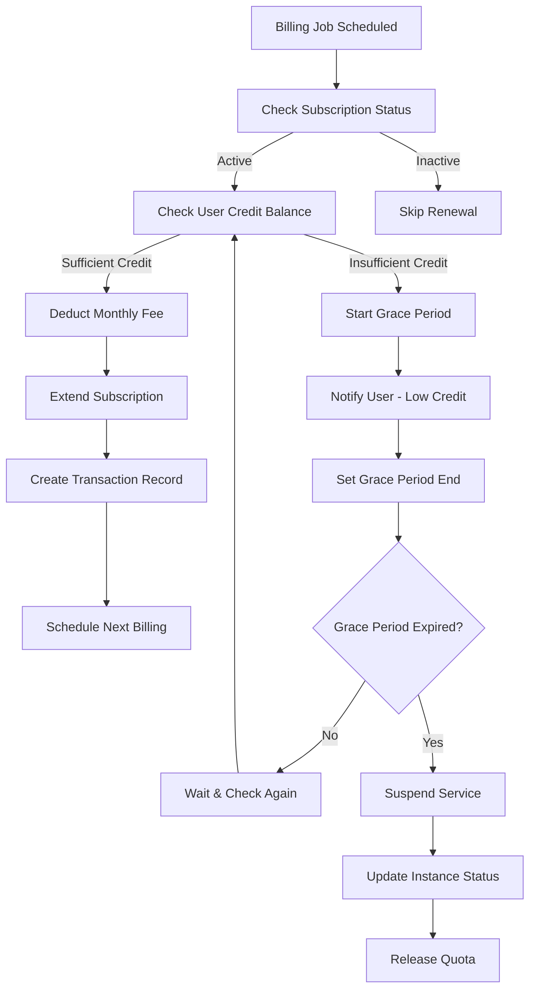

# Credit-Based Billing System Design

## Overview

Sistem pembayaran menggunakan model **prepaid credit** dimana user melakukan top-up terlebih dahulu, kemudian credit akan terpotong otomatis untuk subscription dan auto-renewal.

## Updated Database Schema

### 1. **User Wallet System**

```prisma
// Add to existing User model
model User {
  // ... existing fields ...

  // Wallet Information
  creditBalance    Decimal @default(0) @db.Decimal(12, 2) // Current credit balance in IDR
  totalTopUp       Decimal @default(0) @db.Decimal(12, 2) // Total lifetime top-up
  totalSpent       Decimal @default(0) @db.Decimal(12, 2) // Total lifetime spending

  // Relations
  refreshTokens    RefreshToken[]
  subscriptions    Subscription[]
  transactions     Transaction[] // New relation

  @@map("users")
}
```

### 2. **Transaction System**

```prisma
enum TransactionType {
  TOP_UP          // User top-up credit
  SUBSCRIPTION    // Monthly subscription charge
  UPGRADE         // Upgrade cost difference
  REFUND          // Refund from cancellation
  ADMIN_ADJUSTMENT // Manual admin adjustment
}

enum TransactionStatus {
  PENDING
  COMPLETED
  FAILED
  CANCELLED
  REFUNDED
}

enum PaymentMethod {
  BANK_TRANSFER
  E_WALLET
  CREDIT_CARD
  ADMIN_MANUAL
}

model Transaction {
  id              String            @id @default(cuid())
  userId          String
  user            User              @relation(fields: [userId], references: [id], onDelete: Cascade)

  // Transaction Details
  type            TransactionType
  status          TransactionStatus @default(PENDING)
  amount          Decimal           @db.Decimal(12, 2) // Amount in IDR

  // Balance Information
  balanceBefore   Decimal           @db.Decimal(12, 2) // User balance before transaction
  balanceAfter    Decimal           @db.Decimal(12, 2) // User balance after transaction

  // Payment Information (for top-ups)
  paymentMethod   PaymentMethod?
  paymentReference String?          // Payment gateway reference
  paymentProof    String?          // Upload proof for manual transfer

  // Subscription Context (for subscription charges)
  subscriptionId  String?
  subscription    Subscription?     @relation(fields: [subscriptionId], references: [id])

  // Transaction Metadata
  description     String           // Human readable description
  metadata        Json?            // Additional data (gateway response, etc.)

  // Admin Information
  processedBy     String?          // Admin ID who processed manual transactions
  adminNotes      String?          // Admin notes

  // Timestamps
  createdAt       DateTime         @default(now())
  updatedAt       DateTime         @updatedAt
  completedAt     DateTime?        // When transaction was completed

  @@map("transactions")
}
```

### 3. **Updated Subscription Model**

```prisma
model Subscription {
  id          String   @id @default(cuid())
  userId      String
  user        User     @relation(fields: [userId], references: [id], onDelete: Cascade)

  serviceId   String
  service     Service  @relation(fields: [serviceId], references: [id])

  planId      String
  plan        ServicePlan @relation(fields: [planId], references: [id])

  status      SubscriptionStatus @default(ACTIVE)

  // Billing Information
  startDate   DateTime @default(now())
  endDate     DateTime // Next billing date
  lastBilled  DateTime?
  nextBilling DateTime? // Next scheduled billing

  // Credit-based Billing
  monthlyPrice    Decimal @db.Decimal(10, 2) // Cached price at subscription time
  lastChargeAmount Decimal? @db.Decimal(10, 2) // Last successful charge
  failedCharges   Int @default(0) // Count of failed auto-renewals

  // Upgrade System
  previousPlanId String?
  upgradeDate    DateTime?
  downgradeTo    String?

  // Auto-renewal Settings
  autoRenew   Boolean @default(true)

  // Grace Period (when credit insufficient)
  gracePeriodEnd DateTime? // When service will be suspended

  createdAt   DateTime @default(now())
  updatedAt   DateTime @updatedAt

  // Relations
  instances   ServiceInstance[]
  transactions Transaction[] // Track all billing transactions

  @@unique([userId, serviceId], name: "unique_user_service_subscription")
  @@map("subscriptions")
}
```

### 4. **Auto-Renewal Job Tracking**

```prisma
enum JobStatus {
  PENDING
  PROCESSING
  COMPLETED
  FAILED
  SKIPPED
}

model BillingJob {
  id              String    @id @default(cuid())
  subscriptionId  String
  subscription    Subscription @relation(fields: [subscriptionId], references: [id], onDelete: Cascade)

  jobType         String    // "auto_renewal", "grace_period_check", "suspension"
  status          JobStatus @default(PENDING)

  scheduledAt     DateTime  // When job should run
  startedAt       DateTime?
  completedAt     DateTime?

  // Job Results
  success         Boolean?
  errorMessage    String?
  attempts        Int @default(0)
  maxAttempts     Int @default(3)

  // Job Data
  jobData         Json?     // Additional job parameters

  createdAt       DateTime @default(now())
  updatedAt       DateTime @updatedAt

  @@map("billing_jobs")
}

// Add relation to Subscription
model Subscription {
  // ... existing fields ...
  billingJobs BillingJob[]
}
```

## Credit-Based Workflow

### 1. **Top-Up Credit Flow**



### 2. **Subscription with Credit Check**



### 3. **Auto-Renewal with Credit System**



## API Endpoints for Credit System

### 1. **Wallet Management**

```http
# Get user wallet balance
GET /api/user/wallet
Headers: Authorization: Bearer <jwt_token>
Response: {
  success: true,
  data: {
    creditBalance: 85000,
    totalTopUp: 200000,
    totalSpent: 115000,
    pendingTransactions: 1,
    lastTopUp: {
      amount: 100000,
      date: "2024-01-15T10:30:00Z",
      method: "BANK_TRANSFER"
    }
  }
}

# Request top-up
POST /api/user/wallet/topup
Headers: Authorization: Bearer <jwt_token>
Body: {
  amount: 100000,
  paymentMethod: "BANK_TRANSFER"
}
Response: {
  success: true,
  data: {
    transactionId: "txn_123",
    amount: 100000,
    paymentMethod: "BANK_TRANSFER",
    paymentInstructions: {
      bankName: "BCA",
      accountNumber: "1234567890",
      accountName: "PT MinisPod",
      uniqueCode: "001",
      totalAmount: 100001,
      expiredAt: "2024-01-16T10:30:00Z"
    }
  }
}

# Upload payment proof
POST /api/user/wallet/topup/:transactionId/proof
Headers: Authorization: Bearer <jwt_token>
Body: FormData with file upload
Response: {
  success: true,
  data: {
    message: "Payment proof uploaded successfully",
    status: "PENDING_VERIFICATION"
  }
}

# Get transaction history
GET /api/user/wallet/transactions
Headers: Authorization: Bearer <jwt_token>
Query: ?type=TOP_UP&status=COMPLETED&page=1&limit=20
Response: {
  success: true,
  data: {
    transactions: [
      {
        id: "txn_123",
        type: "TOP_UP",
        status: "COMPLETED",
        amount: 100000,
        balanceBefore: 50000,
        balanceAfter: 150000,
        description: "Top-up via Bank Transfer",
        createdAt: "2024-01-15T10:30:00Z",
        completedAt: "2024-01-15T11:00:00Z"
      }
    ],
    pagination: { total: 25, page: 1, limit: 20 }
  }
}
```

### 2. **Credit-Based Subscription**

```http
# Subscribe with credit check
POST /api/user/services/subscribe
Headers: Authorization: Bearer <jwt_token>
Body: {
  serviceId: "svc_123",
  planId: "plan_124"
}
Response: {
  success: true,
  data: {
    subscriptionId: "sub_124",
    chargedAmount: 15000,
    newBalance: 85000,
    transactionId: "txn_124",
    message: "Service subscribed successfully"
  }
}
# Error if insufficient credit:
{
  success: false,
  error: {
    code: "INSUFFICIENT_CREDIT",
    message: "Insufficient credit balance",
    details: {
      required: 15000,
      available: 10000,
      shortfall: 5000
    }
  }
}

# Upgrade with credit difference
PUT /api/user/services/subscriptions/:subscriptionId/upgrade
Headers: Authorization: Bearer <jwt_token>
Body: {
  newPlanId: "plan_125"
}
Response: {
  success: true,
  data: {
    subscriptionId: "sub_124",
    upgradeCost: 10000, // Prorated difference
    newBalance: 75000,
    transactionId: "txn_125",
    message: "Subscription upgraded successfully"
  }
}
```

### 3. **Admin Wallet Management**

```http
# Get user wallet details (admin)
GET /api/admin/users/:userId/wallet
Headers: Authorization: Bearer <admin_jwt_token>
Response: {
  success: true,
  data: {
    user: { name: "John Doe", email: "john@example.com" },
    creditBalance: 85000,
    totalTopUp: 200000,
    totalSpent: 115000,
    pendingTransactions: 1,
    recentTransactions: [...]
  }
}

# Manual credit adjustment (admin)
POST /api/admin/users/:userId/wallet/adjust
Headers: Authorization: Bearer <admin_jwt_token>
Body: {
  amount: 50000, // Positive for credit, negative for debit
  reason: "Compensation for service downtime",
  adminNotes: "Approved by customer service"
}
Response: {
  success: true,
  data: {
    transactionId: "txn_126",
    newBalance: 135000,
    message: "Credit adjustment completed"
  }
}

# Approve manual top-up
PUT /api/admin/transactions/:transactionId/approve
Headers: Authorization: Bearer <admin_jwt_token>
Body: {
  approved: true,
  adminNotes: "Payment verified"
}
Response: {
  success: true,
  data: {
    transactionId: "txn_123",
    newUserBalance: 150000,
    message: "Top-up approved and credited"
  }
}
```

## Business Logic Implementation

### 1. **Credit Management Service**

```javascript
class CreditService {
  async checkSufficientCredit(userId, requiredAmount) {
    const user = await prisma.user.findUnique({
      where: { id: userId },
    });

    return user.creditBalance >= requiredAmount;
  }

  async deductCredit(userId, amount, description, subscriptionId = null) {
    return await prisma.$transaction(async (tx) => {
      const user = await tx.user.findUnique({
        where: { id: userId },
      });

      if (user.creditBalance < amount) {
        throw new Error("INSUFFICIENT_CREDIT");
      }

      // Update user balance
      const updatedUser = await tx.user.update({
        where: { id: userId },
        data: {
          creditBalance: { decrement: amount },
          totalSpent: { increment: amount },
        },
      });

      // Create transaction record
      const transaction = await tx.transaction.create({
        data: {
          userId,
          type: subscriptionId ? "SUBSCRIPTION" : "ADMIN_ADJUSTMENT",
          status: "COMPLETED",
          amount: -amount, // Negative for deduction
          balanceBefore: user.creditBalance,
          balanceAfter: updatedUser.creditBalance,
          description,
          subscriptionId,
          completedAt: new Date(),
        },
      });

      return { user: updatedUser, transaction };
    });
  }

  async addCredit(userId, amount, description, paymentMethod = null) {
    return await prisma.$transaction(async (tx) => {
      const user = await tx.user.findUnique({
        where: { id: userId },
      });

      const updatedUser = await tx.user.update({
        where: { id: userId },
        data: {
          creditBalance: { increment: amount },
          totalTopUp: { increment: amount },
        },
      });

      const transaction = await tx.transaction.create({
        data: {
          userId,
          type: "TOP_UP",
          status: "COMPLETED",
          amount,
          balanceBefore: user.creditBalance,
          balanceAfter: updatedUser.creditBalance,
          description,
          paymentMethod,
          completedAt: new Date(),
        },
      });

      return { user: updatedUser, transaction };
    });
  }
}
```

### 2. **Auto-Renewal Service**

```javascript
class AutoRenewalService {
  async processAutoRenewal(subscriptionId) {
    const subscription = await prisma.subscription.findUnique({
      where: { id: subscriptionId },
      include: { user: true, plan: true, service: true },
    });

    if (!subscription.autoRenew || subscription.status !== "ACTIVE") {
      return { success: false, reason: "Auto-renewal disabled or inactive" };
    }

    const monthlyPrice = subscription.monthlyPrice;

    try {
      // Check credit balance
      if (subscription.user.creditBalance < monthlyPrice) {
        return await this.handleInsufficientCredit(subscription);
      }

      // Deduct credit
      const { transaction } = await this.creditService.deductCredit(
        subscription.userId,
        monthlyPrice,
        `Auto-renewal for ${subscription.service.name}`,
        subscriptionId
      );

      // Extend subscription
      const nextBilling = new Date();
      nextBilling.setMonth(nextBilling.getMonth() + 1);

      await prisma.subscription.update({
        where: { id: subscriptionId },
        data: {
          lastBilled: new Date(),
          nextBilling,
          endDate: nextBilling,
          lastChargeAmount: monthlyPrice,
          failedCharges: 0,
          gracePeriodEnd: null,
        },
      });

      // Schedule next billing
      await this.scheduleBillingJob(subscriptionId, nextBilling);

      return { success: true, transactionId: transaction.id };
    } catch (error) {
      return await this.handleRenewalError(subscription, error);
    }
  }

  async handleInsufficientCredit(subscription) {
    const gracePeriod = 7; // 7 days grace period
    const gracePeriodEnd = new Date();
    gracePeriodEnd.setDate(gracePeriodEnd.getDate() + gracePeriod);

    await prisma.subscription.update({
      where: { id: subscription.id },
      data: {
        failedCharges: { increment: 1 },
        gracePeriodEnd,
      },
    });

    // Notify user about insufficient credit
    await this.notificationService.sendLowCreditAlert(subscription.userId, {
      serviceName: subscription.service.name,
      requiredAmount: subscription.monthlyPrice,
      currentBalance: subscription.user.creditBalance,
      gracePeriodEnd,
    });

    // Schedule grace period check
    await this.scheduleBillingJob(
      subscription.id,
      gracePeriodEnd,
      "grace_period_check"
    );

    return { success: false, reason: "Insufficient credit", gracePeriodEnd };
  }
}
```

### 3. **Subscription Validation with Credit Check**

```javascript
class SubscriptionService {
  async validateSubscription(userId, serviceId, planId) {
    // Existing validations...
    await super.validateNewSubscription(userId, serviceId, planId);

    // Credit validation
    const user = await prisma.user.findUnique({
      where: { id: userId },
    });

    const plan = await prisma.servicePlan.findUnique({
      where: { id: planId },
    });

    if (user.creditBalance < plan.monthlyPrice) {
      throw new ValidationError(
        "INSUFFICIENT_CREDIT",
        "Insufficient credit balance for subscription",
        {
          required: plan.monthlyPrice,
          available: user.creditBalance,
          shortfall: plan.monthlyPrice - user.creditBalance,
        }
      );
    }

    return true;
  }
}
```

## Updated Implementation Priority

### **Phase 1.5: Credit System (Week 2)**

- Add wallet models to database schema
- Implement credit management service
- Create wallet API endpoints
- Basic top-up functionality

### **Phase 2.5: Auto-Renewal System (Week 4)**

- Implement billing job scheduler
- Auto-renewal logic with credit deduction
- Grace period management
- Low credit notifications

Sistem credit ini memberikan kontrol yang lebih baik atas cash flow dan mengurangi payment gateway fees dengan model prepaid yang user-friendly.
