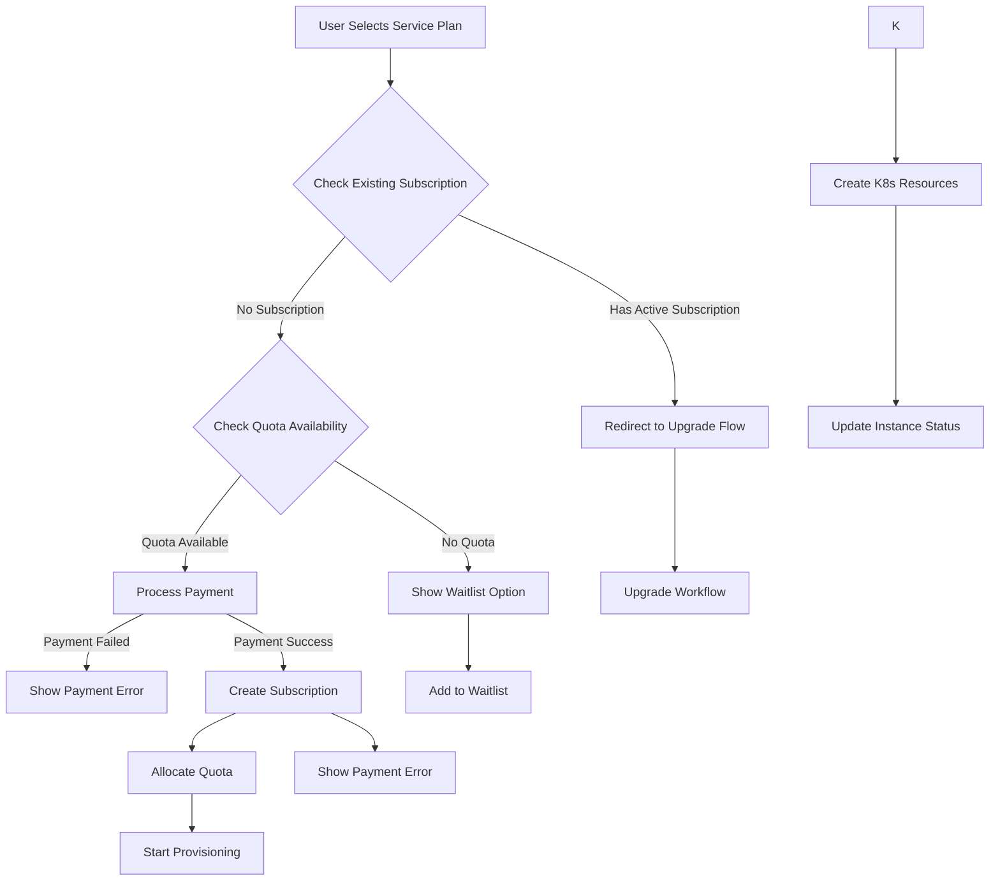
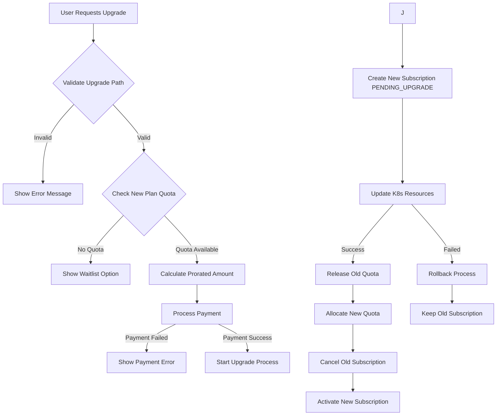
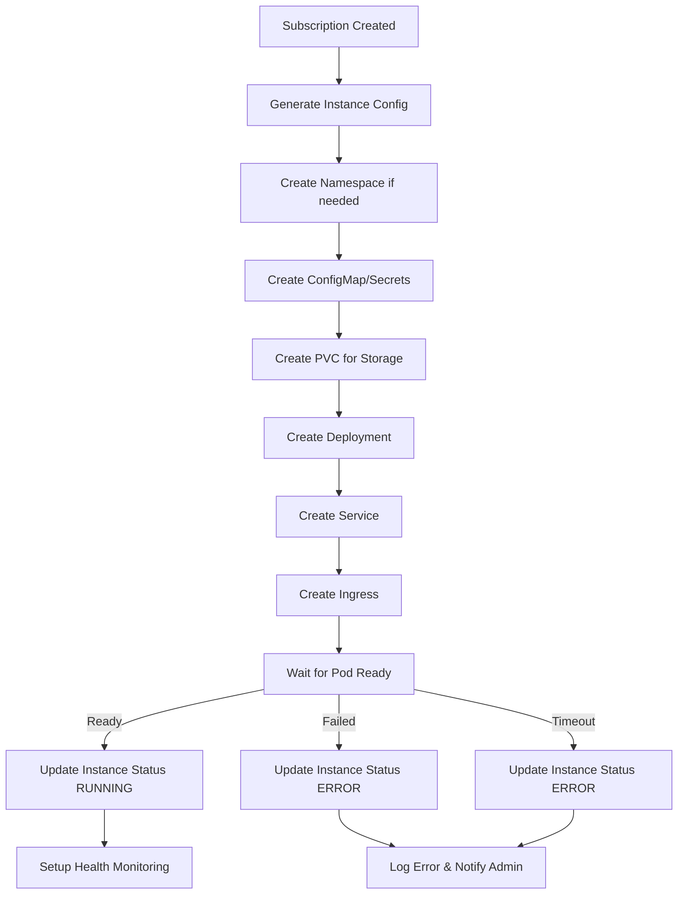

# Service Provisioning Workflow with Upgrade Logic

## Overview

Service provisioning workflow menangani lifecycle lengkap dari subscription hingga running instance di Kubernetes, dengan dukungan untuk quota management dan upgrade-only policy.

## 1. SUBSCRIPTION WORKFLOW

### New Subscription Flow



### Upgrade Subscription Flow



## 2. KUBERNETES PROVISIONING WORKFLOW

### Service Instance Provisioning



### Resource Configuration Templates

```yaml
# Namespace Template
apiVersion: v1
kind: Namespace
metadata:
  name: user-{userId}
  labels:
    minispod.com/user-id: "{userId}"
    minispod.com/managed: "true"

---
# Deployment Template
apiVersion: apps/v1
kind: Deployment
metadata:
  name: {instanceId}
  namespace: user-{userId}
  labels:
    minispod.com/service: "{serviceSlug}"
    minispod.com/instance-id: "{instanceId}"
    minispod.com/user-id: "{userId}"
spec:
  replicas: 1
  selector:
    matchLabels:
      app: {instanceId}
  template:
    metadata:
      labels:
        app: {instanceId}
        minispod.com/service: "{serviceSlug}"
        minispod.com/instance-id: "{instanceId}"
    spec:
      containers:
      - name: app
        image: {dockerImage}
        ports:
        - containerPort: {defaultPort}
        env:
        - name: INSTANCE_ID
          value: "{instanceId}"
        - name: SUBDOMAIN
          value: "{subdomain}"
        # Dynamic env vars from service template and user config
        resources:
          requests:
            cpu: "{cpuMilli}m"
            memory: "{memoryMb}Mi"
          limits:
            cpu: "{cpuMilli * 2}m"
            memory: "{memoryMb * 1.5}Mi"
        volumeMounts:
        - name: data
          mountPath: /data
      volumes:
      - name: data
        persistentVolumeClaim:
          claimName: {instanceId}-data

---
# Service Template
apiVersion: v1
kind: Service
metadata:
  name: {instanceId}
  namespace: user-{userId}
spec:
  selector:
    app: {instanceId}
  ports:
  - port: 80
    targetPort: {defaultPort}
  type: ClusterIP

---
# Ingress Template
apiVersion: networking.k8s.io/v1
kind: Ingress
metadata:
  name: {instanceId}
  namespace: user-{userId}
  annotations:
    nginx.ingress.kubernetes.io/ssl-redirect: "true"
    cert-manager.io/cluster-issuer: "letsencrypt-prod"
spec:
  tls:
  - hosts:
    - {subdomain}.minispod.com
    secretName: {instanceId}-tls
  rules:
  - host: {subdomain}.minispod.com
    http:
      paths:
      - path: /
        pathType: Prefix
        backend:
          service:
            name: {instanceId}
            port:
              number: 80
```

## 3. QUOTA MANAGEMENT WORKFLOW

### Quota Allocation Process

```javascript
// Simplified Quota Management Service
class QuotaService {
  async checkQuotaAvailability(planId) {
    const plan = await prisma.servicePlan.findUnique({
      where: { id: planId },
    });

    const availableQuota = plan.totalQuota - plan.usedQuota;

    if (availableQuota <= 0) {
      throw new Error("QUOTA_EXCEEDED");
    }

    return { available: availableQuota, total: plan.totalQuota };
  }

  async allocateQuota(planId, userId, subscriptionId) {
    const plan = await prisma.servicePlan.findUnique({
      where: { id: planId },
    });

    const availableQuota = plan.totalQuota - plan.usedQuota;

    if (availableQuota <= 0) {
      throw new Error("QUOTA_EXCEEDED");
    }

    await prisma.servicePlan.update({
      where: { id: planId },
      data: {
        usedQuota: { increment: 1 },
      },
    });

    return true;
  }

  async releaseQuota(planId, userId, subscriptionId) {
    await prisma.servicePlan.update({
      where: { id: planId },
      data: {
        usedQuota: { decrement: 1 },
      },
    });

    return true;
  }
}
```

### Upgrade Quota Management

```javascript
class UpgradeService {
  async processUpgrade(subscriptionId, newPlanId) {
    const subscription = await prisma.subscription.findUnique({
      where: { id: subscriptionId },
      include: { plan: true, user: true },
    });

    // Check new plan quota
    await this.quotaService.checkQuotaAvailability(newPlanId);

    try {
      // Start transaction
      await prisma.$transaction(async (tx) => {
        // Create new subscription with PENDING_UPGRADE status
        const newSubscription = await tx.subscription.create({
          data: {
            userId: subscription.userId,
            serviceId: subscription.serviceId,
            planId: newPlanId,
            status: "PENDING_UPGRADE",
            previousPlanId: subscription.planId,
            upgradeDate: new Date(),
            startDate: new Date(),
            endDate: this.calculateNextBilling(new Date()),
            autoRenew: subscription.autoRenew,
          },
        });

        // Update Kubernetes resources
        await this.updateKubernetesResources(subscription, newPlanId);

        // Release old quota
        await this.quotaService.releaseQuota(
          subscription.planId,
          subscription.userId,
          subscriptionId,
          "upgrade"
        );

        // Allocate new quota
        await this.quotaService.allocateQuota(
          newPlanId,
          subscription.userId,
          newSubscription.id
        );

        // Cancel old subscription
        await tx.subscription.update({
          where: { id: subscriptionId },
          data: { status: "CANCELLED" },
        });

        // Activate new subscription
        await tx.subscription.update({
          where: { id: newSubscription.id },
          data: { status: "ACTIVE" },
        });

        return newSubscription;
      });
    } catch (error) {
      // Rollback: no reserved quota to release in simplified system
      throw error;
    }
  }
}
```

## 4. KUBERNETES INTEGRATION WORKFLOW

### Service Provisioning Implementation

```javascript
class KubernetesProvisioningService {
  async provisionService(subscription, instanceConfig) {
    const { service, plan, user } = subscription;
    const namespace = `user-${user.id}`;

    try {
      // Update instance status to PROVISIONING
      await this.updateInstanceStatus(instanceConfig.id, "PROVISIONING");

      // Step 1: Ensure namespace exists
      await this.ensureNamespace(namespace, user.id);

      // Step 2: Create ConfigMap with environment variables
      await this.createConfigMap(namespace, instanceConfig);

      // Step 3: Create PVC for persistent storage
      await this.createPVC(namespace, instanceConfig, plan.storageGb);

      // Step 4: Create Deployment
      await this.createDeployment(namespace, instanceConfig, service, plan);

      // Step 5: Create Service
      await this.createService(namespace, instanceConfig, service);

      // Step 6: Create Ingress
      await this.createIngress(namespace, instanceConfig);

      // Step 7: Wait for pod to be ready
      await this.waitForPodReady(namespace, instanceConfig.id, 300); // 5 minutes timeout

      // Step 8: Update instance status to RUNNING
      await this.updateInstanceStatus(instanceConfig.id, "RUNNING");

      // Step 9: Setup health monitoring
      await this.setupHealthMonitoring(instanceConfig.id);

      return {
        success: true,
        publicUrl: `https://${instanceConfig.subdomain}.minispod.com`,
      };
    } catch (error) {
      // Update instance status to ERROR
      await this.updateInstanceStatus(instanceConfig.id, "ERROR");

      // Cleanup partial resources
      await this.cleanupResources(namespace, instanceConfig.id);

      throw error;
    }
  }

  async updateKubernetesResources(subscription, newPlanId) {
    const newPlan = await prisma.servicePlan.findUnique({
      where: { id: newPlanId },
    });

    const instances = await prisma.serviceInstance.findMany({
      where: { subscriptionId: subscription.id },
    });

    for (const instance of instances) {
      // Update deployment with new resource limits
      await this.updateDeploymentResources(instance, newPlan);

      // Update PVC if storage increased
      if (newPlan.storageGb > subscription.plan.storageGb) {
        await this.expandPVC(instance, newPlan.storageGb);
      }
    }
  }

  async cleanupResources(namespace, instanceId) {
    try {
      // Delete in reverse order
      await this.k8sNetworkingApi.deleteNamespacedIngress(
        instanceId,
        namespace
      );
      await this.k8sCoreApi.deleteNamespacedService(instanceId, namespace);
      await this.k8sAppsApi.deleteNamespacedDeployment(instanceId, namespace);
      await this.k8sCoreApi.deleteNamespacedPersistentVolumeClaim(
        `${instanceId}-data`,
        namespace
      );
      await this.k8sCoreApi.deleteNamespacedConfigMap(instanceId, namespace);
    } catch (error) {
      console.error("Cleanup error:", error);
      // Log but don't throw - cleanup is best effort
    }
  }
}
```

## 5. ERROR HANDLING & RECOVERY

### Provisioning Error Recovery

```javascript
class ProvisioningErrorHandler {
  async handleProvisioningError(instanceId, error) {
    const instance = await prisma.serviceInstance.findUnique({
      where: { id: instanceId },
      include: { subscription: { include: { plan: true, user: true } } },
    });

    // Log error
    await this.logProvisioningError(instanceId, error);

    // Determine recovery action based on error type
    switch (error.code) {
      case "INSUFFICIENT_RESOURCES":
        await this.handleInsufficientResources(instance);
        break;

      case "IMAGE_PULL_ERROR":
        await this.handleImagePullError(instance);
        break;

      case "TIMEOUT":
        await this.handleTimeout(instance);
        break;

      default:
        await this.handleGenericError(instance);
    }
  }

  async handleInsufficientResources(instance) {
    // Try to provision on different node or reduce resources temporarily
    await this.retryWithReducedResources(instance);
  }

  async handleTimeout(instance) {
    // Cleanup and retry once
    await this.cleanupAndRetry(instance);
  }
}
```

## 6. MONITORING & HEALTH CHECKS

### Health Monitoring Setup

```javascript
class HealthMonitoringService {
  async setupHealthMonitoring(instanceId) {
    const instance = await prisma.serviceInstance.findUnique({
      where: { id: instanceId },
    });

    // Schedule periodic health checks
    this.scheduleHealthCheck(instanceId, 60000); // Every minute

    // Setup resource usage monitoring
    this.scheduleResourceMonitoring(instanceId, 300000); // Every 5 minutes
  }

  async performHealthCheck(instanceId) {
    try {
      const instance = await prisma.serviceInstance.findUnique({
        where: { id: instanceId },
      });

      // Check pod status
      const podStatus = await this.checkPodStatus(
        instance.namespace,
        instance.podName
      );

      // Check HTTP endpoint if available
      const httpStatus = await this.checkHttpEndpoint(instance.publicUrl);

      // Update health status
      const healthStatus = this.determineHealthStatus(podStatus, httpStatus);

      await prisma.serviceInstance.update({
        where: { id: instanceId },
        data: {
          healthStatus,
          lastHealthCheck: new Date(),
        },
      });

      // Alert if unhealthy
      if (healthStatus === "unhealthy") {
        await this.sendHealthAlert(instance);
      }
    } catch (error) {
      console.error(`Health check failed for instance ${instanceId}:`, error);
    }
  }
}
```

## 7. BUSINESS LOGIC VALIDATION

### Subscription Validation Rules

```javascript
class SubscriptionValidator {
  async validateNewSubscription(userId, serviceId, planId) {
    // Rule 1: Check for existing active subscription
    const existingSubscription = await prisma.subscription.findFirst({
      where: {
        userId,
        serviceId,
        status: "ACTIVE",
      },
    });

    if (existingSubscription) {
      throw new ValidationError(
        "DUPLICATE_SUBSCRIPTION",
        "User already has active subscription for this service. Use upgrade instead."
      );
    }

    // Rule 2: Check quota availability
    const plan = await prisma.servicePlan.findUnique({
      where: { id: planId },
    });

    const availableQuota = plan.totalQuota - plan.usedQuota;
    if (availableQuota <= 0) {
      throw new ValidationError(
        "QUOTA_EXCEEDED",
        "No available quota for selected plan"
      );
    }

    // Rule 3: Validate plan is active and public
    if (!plan.isActive) {
      throw new ValidationError(
        "INVALID_PLAN",
        "Selected plan is not available"
      );
    }

    return true;
  }

  async validateUpgrade(subscriptionId, newPlanId) {
    const subscription = await prisma.subscription.findUnique({
      where: { id: subscriptionId },
      include: { plan: true },
    });

    const newPlan = await prisma.servicePlan.findUnique({
      where: { id: newPlanId },
    });

    // Rule 1: Can only upgrade to higher tier
    const planHierarchy = ["FREE", "BASIC", "PRO", "PREMIUM", "ENTERPRISE"];
    const currentIndex = planHierarchy.indexOf(subscription.plan.planType);
    const newIndex = planHierarchy.indexOf(newPlan.planType);

    if (newIndex <= currentIndex) {
      throw new ValidationError(
        "INVALID_UPGRADE",
        "Can only upgrade to higher tier plans"
      );
    }

    // Rule 2: Check new plan quota
    const availableQuota = newPlan.totalQuota - newPlan.usedQuota;
    if (availableQuota <= 0) {
      throw new ValidationError(
        "QUOTA_EXCEEDED",
        "No available quota for target plan"
      );
    }

    return true;
  }
}
```

## Implementation Priority

1. **Phase 1**: Basic subscription workflow (new subscriptions)
2. **Phase 2**: Kubernetes provisioning integration
3. **Phase 3**: Quota management system
4. **Phase 4**: Upgrade workflow
5. **Phase 5**: Error handling and recovery
6. **Phase 6**: Health monitoring and alerts

Workflow ini memastikan platform dapat mengelola resource server dengan efisien sambil memberikan user experience yang smooth untuk subscription dan upgrade services.
